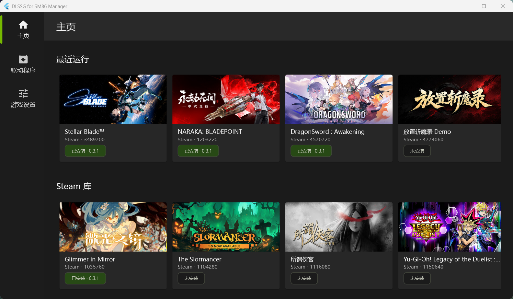
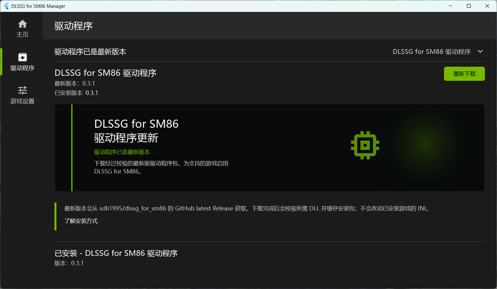
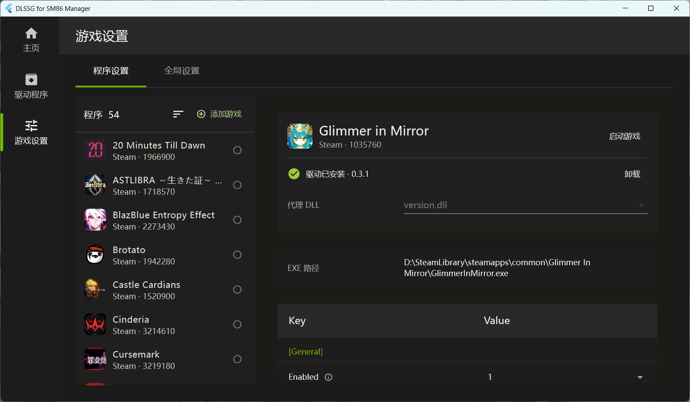

# DLSSG for SM86 Manager

在 RTX 30 系列（SM86）和 RTX 20 系列（SM75）上启用 NVIDIA DLSS 帧生成（DLSS-G）。

`%LOCALAPPDATA%\dlssg_for_sm86_gui` 配置文件路径。

## 开发

需要 Flutter stable，以及 Visual Studio 的 **Desktop development with C++** 工作负载（MSVC、CMake tools、Windows SDK）。

```powershell
flutter pub get
flutter test
```
## 安装

访问 [Release](https://github.com/wojiushixiaobai/dlssg_for_sm86_gui/releases) 下载构建好的二进制文件，解压后执行 dlssg-for-sm86-manager.exe。

## 编译

```powershell
.\tool\package_windows.ps1
```

脚本生成 `release/dlssg-for-sm86-manager-portable.zip`。解压后直接运行。

## 应用截图




